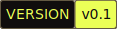

<div id="toc" align="center" style="margin-bottom: 0;">
  <ul style="list-style: none; margin: 0; padding: 0;">
    <a href="https://vfriend.preetham.top/">
      <picture>
        <source media="(prefers-color-scheme: dark)" srcset="./README/dark_logo.png" />
        
      </picture>
    </a>
  </ul>
</div>

<p align="center">
  <strong>Check status of your friends at any time</strong><br>
  <a href="https://vfriend.preetham.top/privacy">Download the App</a>
</p>

<p align="center">
  <a href="https://github.com/ppmpreetham/vfriend?tab=MIT-1-ov-file#">
    <picture>
      <source media="(prefers-color-scheme: dark)" srcset="./README/dark_license.svg" />
      
    </picture>
  </a>
  <a href="https://github.com/ppmpreetham/vfriend/releases/">
    <picture>
      <source media="(prefers-color-scheme: dark)" srcset="./README/dark_version.svg" />
      
    </picture>
  </a>
</p>

<div align="center" style="display: flex; justify-content: center; gap: 10px; flex-wrap: wrap;">
  <div style="display: flex; flex-direction: row; overflow-x: auto; gap: 10px; padding: 10px;">
    
    
    
  </div>
</div>

> [!WARNING]  
> This app is still in development, and is not yet ready for production use. There are many features that are still missing, and there may be bugs. Please use it at your own risk.

## Why VFriend?

An year ago, while I was a freshman at my college, I had an oddly specific problem of having a little too many friends. Oftentimes, I’d often find myself digging through old WhatsApp/Discord chats, trying to find the timetables they had sent me, one by one, over and over. It was tedious, repetitive, and honestly, a little ridiculous. I kept thinking, there has to be a better way to do this. But back then, I didn’t know much about app development. I had spent time learning web dev, but even now, as I write this, you could say, this is my first real app.

## Usage

0. **Install Node.js**: Make sure you have Node.js installed on your system. You can download it from [nodejs.org](https://nodejs.org/).
1. **Install pnpm**: If you haven't already, install `pnpm` globally
   ```bash
   npm install -g pnpm
   ```
2. **Install Rust**: Make sure you have Rust installed on your system. You can download it from [rustup.rs](https://rustup.rs/).
3. **Install Tauri CLI**: Install the Tauri CLI globally using `pnpm`:
   ```bash
   pnpm install -g @tauri-apps/cli
   ```
4. **Install Tauri**: Follow the [Tauri installation guide](https://tauri.app/v2/getting-started/prerequisites/) to set up your environment.

5. **Clone the Repository**:
   ```bash
   git clone https://github.com/ppmpreetham/vfriend.git
   cd vfriend
   ```
6. **Install Dependencies**:
   ```bash
    pnpm i
   ```
7. **Change the IP**:
   Open `src-tauri/tauri.conf.json` and change the `devPath` to your IP address. For example:
   ```json
   "devPath": "http://172.22.198.42:1420/"
   ```
8. **Run the App**:
   ```bash
     pnpm tauri dev
   ```
9. **Build the App**:
   ```bash
     pnpm tauri build
   ```

### Android

To build the app for Android, you need to have the Android SDK and NDK installed. Follow the [Tauri Android guide](https://tauri.app/v2/guides/mobile/android/) for detailed instructions.

0. Add this to `.vscode/settings.json` to ignore Tauri's Android schema:

```json
"yaml.schemaStore.enable": false
```

1. First, initialize the Android project:
   ```bash
   pnpm tauri android init
   ```
2. Change these permissions for file access:
   Include the following permissions to the `manifest` tag in the `gen/android/app/src/main/AndroidManifest.xml` file:
   ```xml
   <uses-permission android:name="android.permission.READ_EXTERNAL_STORAGE" />
   <uses-permission android:name="android.permission.WRITE_EXTERNAL_STORAGE" />
   ```
3. (Optional) Copy the `build.gradle.kts` to `gen/android/app/build.gradle.kts`:

   ```bash
   cp src-tauri/gen/android/build.gradle.kts src-tauri/gen/android/app/build.gradle.kts
   ```

4. Then, build the app for Android:
   ```bash
   pnpm tauri android build
   ```

## TO-DO

- [x] Seperate stores for oneSelf and friends
- [x] Remove redundant and unused Hooks
- [x] Add support for [Deep-Links](https://v2.tauri.app/plugin/deep-linking/#setting-up) on Mobile(Android and IOS)
- [x] Better addFriend functionality
- [x] Setup Permissions for fs, Dialog for Mobile(Android and IOS)
- [x] Fix Dialog for Android (currently gives content://com.android.providers.media.documents/document/document%3A1000313997)
- [x] Friend page Search functionality
- [ ] Share link to add friend functionality
- [ ] QR Code deeplink functionality
- [ ] Deep-Link onClick functionality
- [ ] Friend individual page
- [ ] peer-to-peer functionality
- [ ] Update Self Timetable
- [ ] Update Friend Timetable
- [ ] NFC Functionality (optional)
- [ ] Ability to change the time format
- [ ] Settings page
- [ ] multiple themes
- [ ] Calendar page
